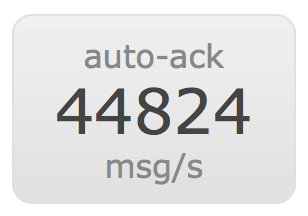

# RabbitMQ Performance Tool #

We have created a couple of tools to facilitate benchmarking RabbitMQ
in different usage scenarios.  One part of these tools is the `PerfTest`
Java class, the other part is a
couple of HTML/JS tools that will let you plot the results obtained
from the benchmarks into nicely looking graphs.

The following blog posts show some examples of what can be done with
this library:

[RabbitMQ Performance Measurements, part
1](https://www.rabbitmq.com/blog/2012/04/17/rabbitmq-performance-measurements-part-1/).
[RabbitMQ Performance Measurements, part
2](https://www.rabbitmq.com/blog/2012/04/25/rabbitmq-performance-measurements-part-2/).

## Running benchmarks ##

Let's see how to run some benchmarks and then display the results in
HTML using this tool.

To run a benchmark we need to create a _benchmark specification file_,
which is simply a JSON file like this one:

```javascript
[{'name': 'consume', 'type': 'simple', 'params':
[{'time-limit': 30, 'producer-count': 4, 'consumer-count': 2}]}]
```

Place this code in a file called `publish-consume-spec.js` and then go
to the root folder of the binary distribution and run the following
command to start the benchmark:

```bash
bin/runjava com.rabbitmq.perf.PerfTestMulti
publish-consume-spec.js publish-consume-result.js
```

This command will start a benchmark scenario where four producers
will send messages to RabbitMQ over a period of thirty seconds. At the
same time, two consumers will be consuming those messages.

The results will be stored in the file `publish-consume-result.js`
which we will now use to display a graph in our HTML page.

## Displaying benchmark results ##

Provided you have included our libraries (refer to the "Boilerplate
HTML" section to know how to do that), the following HTML snippet will 
display the graph for the benchmark that we just ran:

```html
<div class="chart"
  data-type="time"
  data-latency="true"
  data-x-axis="time (s)"
  data-y-axis="rate (msg/s)"
  data-y-axis2="latency (μs)"
  data-scenario="consume"></div>
```

Here we use HTML's _data_ attributes to tell the performance library
how the graph should be displayed. We are telling it to load the
`consume` scenario, showing time in seconds on the x-axis, the rate of
messages per second on the y-axis and a second y-axis showing latency
in microseconds; all of this displayed in a _time_ kind of graph:


If instead of the CSS class `"chart"` we use the `"small-chart"` CSS
class, then we can get a graph like the one below:

```html
<div class="small-chart"
  data-type="time"
  data-x-axis="time(s)"
  data-y-axis=""
  data-scenario="no-ack"></div>
```


Finally, there's a type of graphs called `"summary"` that can show a summary of the whole benchmark. Here's the _HTML_ for displaying them:

```html
<div class="summary"
  data-scenario="shard"></div>
```

And this is how they look like:




## Types of graphs ##

We support several `types` of graphs, that you can specify using the
`data-type` attribute:

- `time`: this graph can plot several variables on the y-axis while
  plotting the time on the x-axis. For example you could compare the 
  send and receive rate over a period of time.

In the previous section we showed how to display these kind of graphs
using HTML.

- `series`: will plot how changing a variable affects the results of
  the benchmark, for example, what's the difference in speed from
  sending small, medium and large messages?. This type of graph can
  show you that.

Here's an HTML example of a `series` graph:

```html
<div class="chart"
  data-type="series"
  data-scenario="message-sizes-and-producers"
  data-x-key="producerCount"
  data-x-axis="producers"
  data-y-axis="rate (msg/s)"
  data-plot-key="send-msg-rate"
  data-series-key="minMsgSize"></div>
```

- `x-y`: we can use this one to compare, for example, how message size
  affects the message rate per second. Refer to the second
  blogpost for an example of this kind of graph.


Here's how to represent an `x-y` graph in HTML:

```html
<div class="chart"
  data-type="x-y"
  data-scenario="message-sizes-large"
  data-x-key="minMsgSize"
  data-plot-keys="send-msg-rate send-bytes-rate"
  data-x-axis="message size (bytes)"
  data-y-axis="rate (msg/s)"
  data-y-axis2="rate (bytes/s)"
  data-legend="ne"></div>
```

- `r-l`: This type of graph can help us compare the sending rate of
  messages vs. the latency. See scenario "1 -> 1 sending rate
  attempted vs latency" from the first blogpost for an example:


Here how's to draw a `r-l` graph with HTML:

```html
<div class="chart"
  data-type="r-l"
  data-x-axis="rate attempted (msg/s)"
  data-y-axis="rate (msg/s)"
  data-scenario="rate-vs-latency"></div>
```

To see how all these benchmark specifications can be put together
take a look at the `various-spec.js` file in the HTML examples directory,
The `various-result.js` file in the same directory contains
the results of the benchmark process run on a particular computer
and `various.html` shows you how to display the results in an
HTML page.

## Supported HTML attributes ##

We can use several HTML attributes to tell the library how to draw the
chart. Here's the list of the ones we support.

- `data-file`: this specifies the file from where to load the
  benchmark results, for example
  `data-file="results-mini-2.7.1.js"`. This file will be loaded via
  AJAX. If you are loading the results on a local machine, you might
  need to serve this file via HTTP, since certain browsers refuse
  to perform the AJAX call otherwise.

- `data-scenario`: A results file can contain several scenarios. This
  attribute specifies which one to display in the graph.

- `data-type`: The type of graph as explained above in "Types of
  Graphs".

- `data-mode`: Tells the library from where to get the message
  rate. Possible values are `send` or `recv`. If no value is
  specified, then the rate is the average of the send and receive
  rates added together.

- `data-latency`: If we are creating a chart to display latency, then
  by specifying the `data-latency` as `true` the average latency will
  also be plotted alongside _send msg rate_ and _receive msg rate_.

- `data-x-axis`, `data-y-axis`, `data-y-axis2`: These attributes
  specify the label of the `x` and the `y` axes.

- `data-series-key`: If we want to specify from where which JSON key
  to pick our series data, then we can provide this attribute. For
  example: `data-series-key="minMsgSize"`.

- `data-x-key`: Same as the previous attributed, but for the x
  axis. Example: `data-x-key="minMsgSize"`.

## Boilerplate HTML ##

The file `../html/examples/sample.html` shows a full HTML page used to
display some results. You should include the following Javascript
Files:

```html
<!--[if lte IE 8]><script language="javascript"type="text/javascript" src="../lib/excanvas.min.js"></script><![endif]-->
<script language="javascript" type="text/javascript" src="../lib/jquery.min.js"></script>
<script language="javascript" type="text/javascript" src="../lib/jquery.flot.min.js"></script>
<script language="javascript" type="text/javascript" src="../perf.js"></script>
```

Our `perf.js` library depends on the  _jQuery_ and _jQuery Flot_ libraries for
drawing graphs, and the _excanvas_ library for supporting older browsers.

Once we load the libraries we can initialize our page with the
following Javascript:

```html
<script language="javascript" type="text/javascript">
$(document).ready(function() {
  var main_results;
    $.ajax({
        url: 'publish-consume-result.js',
        success: function(data) {
            render_graphs(JSON.parse(data));
        },
        fail: function() { alert('error loading publish-consume-result.js'); }
    });
});
</script>
```

We can then load the file with the benchmark results and pass that to our
`render_graphs` function, which will take care of the rest, provided
we have defined the various `div`s where our graphs are going to be
drawn.

## Writing benchmark specifications ##

Benchmarks specifications should be written in JSON format. We can
define an array containing one or more benchmark scenarios to run. For
example:

```javascript
[ {'name': 'no-ack-long', 'type': 'simple', 'interval': 10000,
  'params': [{'time-limit': 500}]},

 {'name': 'headline-publish', 'type': 'simple', 'params':
  [{'time-limit': 30, 'producer-count': 10, 'consumer-count': 0}]}]
```

This JSON object specifies two scenarios `'no-ack-long'` and
`'headline-publish'`, of the type `simple` and sets
parameters, like `producer-count`, for the benchmarks.

There are three kind of benchmark scenarios:

- `simple`: runs a basic benchmark based on the parameters in the spec
  as seen in the example above.
- `rate-vs-latency`: compares message rate with latency.
- `varying`: can vary some variables during the benchmark, for example
  message size as shown in the following scenario snippet:

```javascript
{'name': 'message-sizes-small', 'type': 'varying',
 'params': [{'time-limit': 30}], 'variables': [{'name':
 'min-msg-size', 'values': [0, 100, 200, 500, 1000, 2000, 5000]}]},
```

Note that `min-msg-size` gets converted to `minMsgSize`.

You can also set the AMQP URI. See the [URI Spec](https://www.rabbitmq.com/uri-spec.html).
Default to `"amqp://localhost"` . For example:

```javascript
[{'name': 'consume', 'type': 'simple', 'uri': 'amqp://rabbitmq_uri',
  'params': [{'time-limit': 30, 'producer-count': 4, 'consumer-count': 2}]}]
```

### Supported scenario parameters ###

The following parameters can be specified for a scenario:

- exchange-type: exchange type to be used during the
  benchmark. Defaults to `'direct'`
- exchange-name: exchange name to be used during the
  benchmark. Defaults to whatever `exchangeType` was set to.
- queue-names: list of queue names to be used during the benchmark. Defaults to
  a single queue, letting RabbitMQ provide a random queue name.
- routing-key: routing key to be used during the benchmark. Defaults to
  an empty routing key.
- random-routing-key: allows the publisher to send a different routing
  key per published message. Useful when testing exchanges like the
  consistent hashing one. Defaults to `false`.
- producer-rate-limit: limit number of messages a producer will produce
  per second. Defaults to `0.0f`
- consumer-rate-limit: limit number of messages a consumer will consume
  per second. Defaults to 0.0f
- producer-count: number of producers to run for the benchmark. Defaults
  to 1
- consumer-count: number of consumers to run for the benchmark. Defaults
  to 1
- producer-tx-size: number of messages to send before committing the
  transaction. Defaults to 0, i.e.: no transactions
- consumer-tx-size: number of messages to consume before committing the
  transaction. Defaults to 0, i.e.: no transactions
- confirm: specifies whether to wait for publisher confirms during the
  benchmark. Defaults to -1. Any number >= 0 will make the benchmarks
  to use confirms.
- auto-ack: specifies whether the benchmarks should auto-ack messages. Defaults
  to `false`.
- multi-ack-every: specifies whether to send a multi-ack every X seconds. Defaults
  to `0`.
- channel-prefetch: sets the per-channel prefetch. Defaults to `0`.
- consumer-prefetch: sets the prefetch consumers. Defaults to `0`.
- min-msg-size: the size in bytes of the messages to be
  published. Defaults to `0`.
- time-limit: specifies how long the benchmark should be run. Defaults to`0`.
- producer-msg-count: number of messages to be published by the producers.
   Defaults to `0`.
- consumer-msg-count: number of messages to be consumed by the consumer. Defaults to `0`.
- msg-count: single flag to set the previous two counts to the same value.
- flags: flags to pass to the producer, like `"mandatory"`,
  or `"persistent"`. Defaults to an empty list.
- predeclared: tells the benchmark tool if the exchange/queue name
  provided already exists in the broker. Defaults to `false`.

## Starting a web server to display the results ##

Some browsers may need to use a web server (`file://` wouldn't work).

From the `html` directory, you can start a web server with Python:

$ python -m SimpleHTTPServer

As an alternative, from the root directory of the binary distribution,
you can launch a Java-based web server:

```
bin/runjava com.rabbitmq.perf.WebServer
```

The latter command starts a web server listening on port 8080, with the
`html` directory as its base directory. You can then see the included
sample at http://localhost:8080/examples/sample.html. To change these defaults:

```
bin/runjava com.rabbitmq.perf.WebServer ./other-base-dir 9090
```

At last, if you want a quick preview of your results (same layout
as the first 'consume' scenario above), ensure the scenario name is
'benchmark' in the result file and launch the following command:

```
$ bin/runjava com.rabbitmq.perf.BenchmarkResults my-result-file.js
```

The latter command will start a web server on port 8080 and open
a browser window to display the results.

